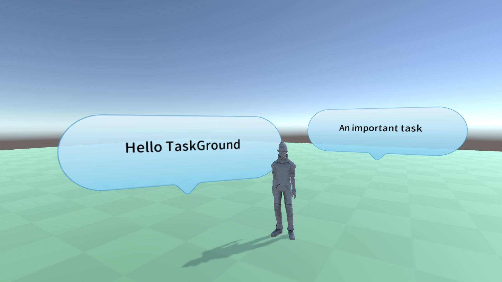

# TaskGround
An Unity asset which puts tasks on scenes

## Overview
* Put task baloons on your Unity scenes
* Tasks can sync with external task management services (currently supports only Trello)
* Compatible with both 2D and 3D games

This asset is inspired by task management system which used in "The Legend of Zelda: Breath of the Wild" and which was announced in CEDEC 2017 in Japan.

http://www.4gamer.net/games/341/G034168/20170901120/ (Japanese)

## Installation
1. Download latest taskground.unitypackage from Relases.
2. Open in your Unity project and select "Assets>Import New Asset...".
3. Select downloaded taskground.unitypackage.

## Setting
### Project-wide settings
This assets requires logging into Trello.
First, log in and select board that Taskground uses.

1. Open Taskground window from "Window>TaskGround"
2. Select "Setting" tab and click "Authorize" button in "Trello settings".
3. Authorizing page will open on browser, then log in.
4. Copy token which is shown in brower, and paste it to "Token" textbox in TaskGround window.
5. Wait a minute and board selecting spinner will be shown. Select a board you are going to use in TaskGround (recommend to create a new board for TaskGround in browser).

TaskGround uses only ONE Trello board in all Unity scenes of certain Unity project and uses one Trello list per Unity scene.

### Scene settings

1. Before settings, create new Trello list in selected Trello board by using browser.
2. Create TaskGround object from "Create>TaskGround".
3. Press "Sync" button in "Task Ground Brain Trello" component.
4. If access to Trello succeed, list selecting spinner will be shown. Select list made in 1.
5. Press "Sync" again.

## How to use

## References

PersistentAmongPlayMode_Unity
https://github.com/tsubaki/SerializedParameter_Unity

MiniJSON
https://gist.github.com/darktable/1411710

EditorCoroutine
http://qiita.com/k_yanase/items/686fc3134c363ffc5239